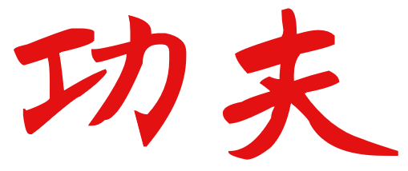

No Encontro Temático à Distância dessa semana, Matheus Azevedo propôs inocentemente que se falasse sobre Kung Fu (功夫), um tema que daria uma vida inteira de conversas, Si Fu optou por começar sobre a etimologia do termo pelos seus dois ideogramas:

O primeiro ideograma 功 (gōng em mandarim e gung1 em cantonês - lido erroneamente como "kungui"), é formado por dois outros: 工 (gōng - mesma leitura),  faz referência ao trabalho propriamente dito ou ao esfoço, muitas vezes intelectual para executar uma tarefa e 力 (lì/lik6) que pode ser traduzido literalmente como energia ou poder, remetendo ao desenho de um arado de terra.

O segundo ideograma é 天 (fū / fu1), é formado por 大 (dài/daai6) que seria uma grande pessoa com uma presilha nos cabelos em referência ao fato de que os homens maduros (ou casados) prendiam o cabelo na china antiga.

Logo, Kung Fu poderia ser lido como o processo de amadurecimento por meio do trabalho. Sendo notável que não haja nada relativo a artes marciais ao analisa-la por seus ideogramas. Si Fu várias vezes comenta que é possível desenvolver Kung Fu em qualquer atividade, mas que o combate, dada a premência de morte, é o meio eficiente.

E você? quer desenvolver seu próprio Kung Fu? Procure um dos núcleos da [Moy Yat Ving Tsun](http://www.myvt-rio.org/) na sua cidade. 
