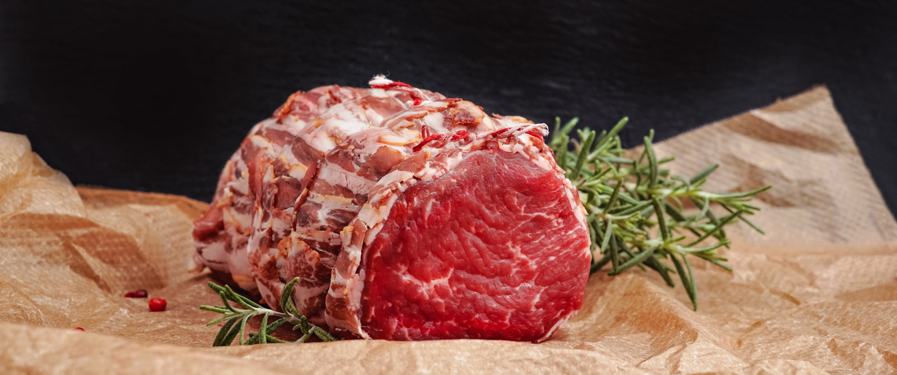

Certa vez [Si Fu](http://mestrejuliocamacho.com "Mestre Julio Camacho")  nos contou a seguinte historieta: 

 _Uma menina curiosa de uma família muito rica estava auxiliando sua mãe no preparo do jantar. Sua mãe pegava um Filet Mignon e ia "descascando" a carne até sobrar apenas seu miolo com um vermelho bem vivo e fresco._ 

 
*Intrigada a menina perguntou: __"Mamãe, o que fazemos com toda essa carne que sobra?"__*

 *— __"Ora... jogamos fora! O que fazer com isso?"__, respondeu a mãe sem entender onde a conversa ia levar.*

*— __"Fora?! mas essa carne tem até aquelas gordurinhas que eu gosto..."__, comentou a menina indignada.*

 *— __"É uma tradição de nossa família, comemos apenas a melhor parte"__, respondeu a mãe cheia de razão enquanto empinava o nariz.*
 
 *Mais alguns cortes, alguns quilos de carne ao lixo a menina inquieta tornou a pergutar:*

 *— __"Mas que tradição é essa? nunca ouvi falar..."__*

 *A mãe interrompeu rapidamente:*

 *— __"Diacho, Menina! Coisa da sua Avó, sempre fizemos assim."__*

*Dias se passaram a menina ficava ainda mais incomodada e foi até a casa dos Avós impaciente, sentiu o cheiro do almoço, correu para a cozinha e saiu perguntando:*

*— __"Vovó! Que história é essa de que na nossa família usamos apenas o miolo do filet para fazer as refeições???"__*

*— __"Que susto, Menina! Eu estou bem e vc? Obrigado por perguntar? Também estou com saudades... "__ A Avó nem olhou para a menina, seguindo concentrada no seu preparo.*

*— __"Desculpe, vovó...estou bem sim, também com saudades... é que minha mãe falou que é tradição da nossa família cortar a carne toda para só preparar os pratos com o miolo"__ - respondeu a menina olhando para baixo encabulada*

*— __"Como assim?"__ - A Avó parou o preparo para dar atenção à menina*

*— __"Mamãe estava preparando carne, cortou toda a parte que estava em volta e jogou fora para ficar apenas com o miolo..."__*

*— __"Hum... tudo errado..."__ - Comentou a idosa para si e voltou-se com tom sério para a menina: — __Quando chegamos na cidade éramos muito pobres e tínhamos que catar lixo e restos para sobreviver. Como a carne era podre ou suja, nós cortavámos a parte externa para tentar salvar o miolo que ainda poderia ser comido..."__*

A história vai até aí. Dado o título já é possível concluir a mensagem principal dela. Colocando uma "Lente Kung Fu ([功夫](https://algumaspalavras.com.br/etimologia-do-termo-kung-fu))" fica claro o quanto podemos deturpar um processo ao executá-lo 
sem atentar para seu [念頭](https://www.mdbg.net/chinese/dictionary?page=worddict&wdrst=0&wdqb=%E5%BF%B5%E9%A0%AD) (niàntou / nim6tau4). 

Mesmo no mais simples procedimento podemos estar condenando todas gerações futuras jogar a "gordurinha boa" no lixo traindo todo o objetivo original. Aliás, [Si Fu](http://mestrejuliocamacho.com "Mestre Julio Camacho")  sempre comenta que Traição e Tradição tem a mesma raíz etimológica, mas deixaremos algumas palavras sobre isso no futuro.

E você já parou para pensar no [念頭](https://www.mdbg.net/chinese/dictionary?page=worddict&wdrst=0&wdqb=%E5%BF%B5%E9%A0%AD) das ações cotidianas? Que tal estar mais atento ao momento presente? Procure um dos núcleos da [Moy Yat Ving Tsun](http://www.myvt-rio.org/) na sua cidade. 

